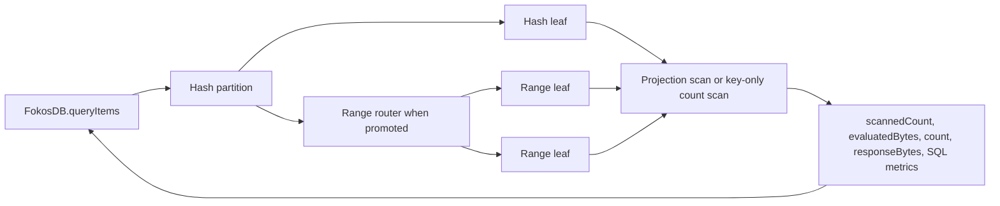

# RFC — `queryItems` count and projection selection

**State:** Implemented
**Date:** 2026-09-11

## Table of contents

- [1. Overview and context](#1-overview-and-context)
- [2. Goals and requirements](#2-goals-and-requirements)
- [3. Milestones](#3-milestones)
- [4. Proposed solution](#4-proposed-solution)
- [5. Alternative options](#5-alternative-options)
- [6. Frequently asked questions](#6-frequently-asked-questions)
- [7. References](#7-references)
- [8. Appendix: workerd SQL experiment](#8-appendix-workerd-sql-experiment)

## 1. Overview and context

FokosDB supports `queryItems` over one or more hash-key sub-queries. Each sub-query can define a sort-key
condition and a scan direction. The operation shares one page budget across all sub-queries.

The current page budget has three counters:

- A byte budget defaults to 3 MiB and has a server maximum of 16 MiB.
- The optional `limit` controls the returned item count.
- A partition-visit budget stops after 100 leaf partitions.

The byte budget currently serves two purposes. It bounds scan work by stored item size. It also bounds the RPC
response. These purposes diverge when a query filters items, projects attributes, or returns only a count.

Partition migration uses the same batch helper with a different byte limit. Its byte budget controls copied
data, RPC payload size, and memory. This use must remain separate from query pagination.

The current `queryItems` API always returns complete items. It cannot request a page count without item
payloads. DynamoDB `Query` supports `Select: COUNT` for this use. The caller follows the cursor and sums page
counts to get a complete count.

FokosDB needs an equivalent bounded operation. It must preserve split, promotion, migration, ordering, and
cursor behavior. It must not add an unbounded server-side count.

The design must also preserve correct behavior for future filters and projections. A filter changes the
relationship between evaluated items, matched items, returned items, and physical SQLite reads. The API must
keep these concepts separate.

This RFC is the source of truth for `queryItems` page accounting. It supersedes the returned-row limit and
full-source byte-budget rules in sections 9.2 and 9.3 of
`docs/agent-plans/2026-08-29-typed-expression-engine-spec.md`. Other expression-engine rules remain in effect.

### 1.1 Terms

| Term | Meaning |
| --- | --- |
| Candidate item | An item that matches the hash-key and sort-key conditions. |
| Evaluated item | A candidate that the logical query page accepts before it stops. |
| Evaluated bytes | The sum of stored `est_row_bytes` values for evaluated items. |
| Matched item | An evaluated item that passes the filter. All evaluated items match before filters exist. |
| Materialized item | A matched item that the operation returns in `items`. |
| Response bytes | An estimate of the serialized RPC bytes for materialized items. |
| Physical row read | A row that SQLite reads from an index, table, CTE, or supporting source. |
| Projection | The attributes that `queryItems` returns for one matched item. |

### 1.2 Page limits

Every page limit has a name. The prose uses the name, and this table holds the value. A change to a
limit changes one row here and no other sentence.

| Name | Value | Meaning |
| --- | --- | --- |
| `DEFAULT_EVALUATED_ITEMS_PER_PAGE` | 1,000 | The evaluated-item budget when the request omits `limit`. |
| `MAX_EVALUATED_ITEMS_PER_PAGE` | 100,000 | The hard maximum that the client clamps `limit` to. |
| `MAX_EVALUATED_BYTES_PER_PAGE` | 100 MiB | The fixed evaluated-byte budget of one page. |
| `DEFAULT_RESPONSE_BYTES_PER_PAGE` | 3 MiB | The response-byte budget when the request omits `maxResponseBytes`. |
| `MAX_RESPONSE_BYTES_PER_PAGE` | 16 MiB | The hard maximum that the client clamps `maxResponseBytes` to. |
| `MAX_PARTITION_VISITS_PER_PAGE` | 100 | The leaf partitions that one page can visit. |
| `MAX_ITEM_BYTES` | 400 KiB | The stored-row ceiling that `shared/transaction-limits.ts` defines and `upsertItem` enforces. |

## 2. Goals and requirements

### 2.1 In scope

1. `queryItems` must accept `select: "projection" | "count"`.
2. The default selection must be `"projection"`.
3. The `"projection"` selection must return the current complete item shape.
4. The `"count"` selection must return `items: []`.
5. The `"count"` selection must return the matched count for one bounded page.
6. The result must expose `scannedCount` as the evaluated item count.
7. The result must redefine `meta.rowsRead` as the physical SQLite read count.
8. The result must redefine `meta.rowsReturned` as the consumed SQL result row count.
9. A request that omits `select` must use projection mode.
10. Query work must have evaluated-item, evaluated-byte, and partition-visit limits.
11. Projection responses must have a separate response-byte limit.
12. Count mode must avoid item-data reads when the query has no filter.
13. Count mode must avoid item payloads in partition RPC responses.
14. The implementation must use a dedicated query collector.
15. The implementation must preserve query behavior during splits, promotions, and migrations.
16. The RFC must record the filter and projection rules that affect pagination.
17. The HTTP example must accept and demonstrate both selections.
18. The existing client-bundle boundary must remain unchanged.

### 2.2 Requirements

1. `limit` must count evaluated items before a future filter runs.
2. The client must default the evaluated-item limit to `DEFAULT_EVALUATED_ITEMS_PER_PAGE` when `limit`
   is absent. This replaces the current unbounded default and is a breaking change of page size.
3. The client must clamp `limit` to `MAX_EVALUATED_ITEMS_PER_PAGE` evaluated items.
4. The evaluated-item budget must apply across all sub-queries and leaf partitions.
5. Each page must have a fixed internal evaluated-byte budget of `MAX_EVALUATED_BYTES_PER_PAGE`.
6. The evaluated-byte budget must apply across all sub-queries and leaf partitions.
7. Each evaluated item must consume its complete stored `est_row_bytes` value.
8. An item that does not fit the remaining evaluated-byte budget must not become an evaluated item.
9. The partition-visit budget must stop after `MAX_PARTITION_VISITS_PER_PAGE` leaf partitions.
10. `maxResponseBytes` must count only materialized item bytes.
11. `maxResponseBytes` must default to `DEFAULT_RESPONSE_BYTES_PER_PAGE`.
12. The client must clamp `maxResponseBytes` to `MAX_RESPONSE_BYTES_PER_PAGE`.
13. Count mode must consume zero item response bytes.
14. A matched projection item must consume its estimated RPC response bytes.
15. A rejected candidate must consume zero response bytes.
16. The first materialized item in the complete page must make progress when it exceeds the response budget.
17. The first-item exception must not apply independently in each partition.
18. The query cursor must advance past every evaluated item.
19. The query cursor must advance past items that a future filter rejects.
20. A candidate that stops on a budget before evaluation must resume from an inclusive cursor.
21. A matched item must increment `count`.
22. An evaluated item must increment `scannedCount`.
23. An evaluated item must increment `evaluatedBytes` by its `est_row_bytes` value.
24. Each SQL result row consumed by JavaScript must increment `meta.rowsReturned`.
25. A row that stops before logical evaluation must still increment `meta.rowsReturned` when JavaScript received it.
26. A physical SQLite row read must increment the applicable leaf `meta.rowsRead`.
27. The implementation must not derive `scannedCount` from `meta.rowsRead`.
28. The implementation must not derive `meta.rowsReturned` from `items.length`, `count`, or `scannedCount`.
29. The implementation must not derive `count` from `items.length` inside partition routing.
30. The implementation must not derive either evaluated budget from `items.length`.
31. An unsatisfiable sub-query must return no results without an RPC.
32. Duplicate sub-queries must count duplicate matches.
33. The query fingerprint must exclude `select`.
34. The query fingerprint must exclude `limit` and `maxResponseBytes`.
35. A cursor from one selection must resume with the other selection.
36. Count and projection pages can stop at different cursor positions.
37. A count page can return `count: 0` with a cursor.
38. A leaf must report actual SQL metrics from `SqlStorageCursor`.
39. A range router must not add itself to `partitionMetas`.
40. A range router must sum the counters from all child responses.
41. A migrating child must use the existing direct-parent query fallback.
42. `internalQueryItemsDirect` must read only the local partition.
43. The implementation must not add a storage schema migration.
44. Migration must keep its existing byte-based batches and `collectBatch` semantics.

### 2.3 Out of scope

| Item | Reason |
| --- | --- |
| A complete count in one request | The work can exceed the CPU and RPC limits of one request. |
| The client pagination helper | A future `FokosStd` class will own pagination helpers. |
| A `projection` request property | This change reserves the selection mode but returns complete items. |
| Filter expressions | This change records pagination constraints but does not add the API or finalize its SQL plan. |
| Projection expressions | A future specification will define the request field, type, SQL plan, and result type. |
| First-class OR conditions | Duplicate sub-queries already support separate ranges. |
| A new query index | The existing `idx_items_scan` index covers the current count path. |
| Global snapshot isolation | The existing query consistency model stays unchanged. |
| Changes to migration limits | Migration keeps its byte-based transfer budget. |
| A count-specific evaluated-byte budget | Count mode reads no item data, so its stored-byte charge is conservative. A future change can raise or remove the charge for count mode after measurement. This RFC keeps one budget for both selections. |

## 3. Milestones

### 3.1 Public and RPC contracts

Add the selection fields, logical counters, validation, and result types. Replace `maxPageBytes` with
`maxResponseBytes`. Add the mandatory evaluated-item and evaluated-byte budgets.

This milestone renames the internal RPC request fields, so it must also rewire `queryItemsLocal` and
`walkRangeChildren` to the new names and report the new counters from the existing scan. The
repository must typecheck and pass its tests at the end of this milestone.

### 3.2 Leaf scan behavior

Add the key-only count scan and the dedicated query collector. Separate the evaluated-item, evaluated-byte,
response-byte, SQL-result-row, and physical-read counters. Count `meta.rowsReturned` at the leaf for each SQL
result row that JavaScript consumes, before logical budget checks. This milestone supports correct pages on one
leaf partition.

### 3.3 Distributed query behavior

Propagate the logical counters through hash forwarding, range routing, promotion, and migration. This milestone
supports the complete partition topology.

### 3.4 Examples, tests, and documentation

Add the HTTP fields, tests, and documentation. Run all package and repository checks.

## 4. Proposed solution

### 4.1 High-level overview

The public operation adds a `select` field with two values. The `"projection"` value returns complete items.
The `"count"` value returns an empty `items` array. Both values return one bounded page.

The query page uses four independent budgets:

- An evaluated-item budget bounds logical item work.
- A fixed evaluated-byte budget bounds the complete stored size of evaluated items.
- A response-byte budget bounds materialized item payloads.
- A partition-visit budget bounds cross-partition fan-out.

Migration keeps a separate byte budget because it moves complete records. Query pagination reuses
`est_row_bytes` only for evaluated-byte accounting. It does not change migration collection semantics.

A count query without a filter scans sort keys and `est_row_bytes` from the covering `idx_items_scan` index. It
does not read `data` and does not transfer item payloads across RPC boundaries.

The leaf tracks `scannedCount`, `evaluatedBytes`, `count`, `responseBytes`, and physical SQL metrics independently.
The range router and client sum these counters.

Future filter and projection work remains out of scope. Section 4.2.13 records constraints that its specification
must resolve before implementation.



### 4.2 Technical details

#### 4.2.1 Public request

`QueryItemsOptions` adds `select` and replaces `maxPageBytes`:

```ts
type QueryItemsOptions = {
	queries: Array<{
		hashKey: string | Uint8Array;
		sortKeyCondition?: SortKeyCondition;
		scanIndexForward?: boolean;
	}>;
	limit?: number;
	maxResponseBytes?: number;
	cursor?: string;
	select?: "projection" | "count";
};
```

When `select` is absent, `FokosDB.queryItems` must use `"projection"`.

A JavaScript caller can provide a value outside the TypeScript union. The public boundary must reject an
unknown value with a `FokosValidationError`. The validation code is `query_select_invalid`.

`limit` is the caller's evaluated-item limit. The client defaults it to
`DEFAULT_EVALUATED_ITEMS_PER_PAGE` and clamps it to `MAX_EVALUATED_ITEMS_PER_PAGE`. The current code
leaves an absent `limit` unbounded, so this default changes the page size of every request that omits
`limit`. Section 4.2.20 records the change.

`maxResponseBytes` is the caller's materialized-item response budget. The client defaults it to
`DEFAULT_RESPONSE_BYTES_PER_PAGE` and clamps it to `MAX_RESPONSE_BYTES_PER_PAGE`.

The client performs this validation. A partition trusts the resolved budgets in the internal request.

#### 4.2.2 Public result

`QueryItemsResult` adds `scannedCount`:

```ts
type QueryItemsResult = {
	items: QueryItem[];
	count: number;
	scannedCount: number;
	cursor?: string;
	meta: QueryItemsMeta;
	partitionMetas: Array<OperationMetrics & PartitionInfo>;
};
```

The result fields have these meanings:

| Field | Meaning |
| --- | --- |
| `items` | The materialized items. Count mode returns an empty array. |
| `count` | The matched items in this page. |
| `scannedCount` | The evaluated items in this page before a future filter. |
| `meta.rowsRead` | The physical SQLite rows read by all leaf query statements. |
| `meta.rowsReturned` | The SQL result rows that leaf collectors consume in JavaScript. |

The following invariants must hold:

```ts
count <= scannedCount;

if (select === "projection") {
	items.length === count;
}

if (select === "count") {
	items.length === 0;
}
```

No numerical invariant connects the SQL metrics to the logical counters. `meta.rowsRead` and
`meta.rowsReturned` measure SQLite work. `scannedCount` and `count` measure the logical page. Neither
metric bounds either counter, in either direction.

`evaluatedBytes` is an internal page counter. The public result does not expose it.

Before filters exist, this invariant also holds:

```ts
count === scannedCount;
```

#### 4.2.3 Query page budget

The query page uses this internal budget:

```ts
type QueryPageBudget = {
	remainingEvaluatedItems: number;
	remainingEvaluatedBytes: number;
	remainingResponseBytes: number;
	remainingPartitionVisits: number;
	allowOversizedFirstItem: boolean;
};
```

The client resolves the four budgets as follows. Section 1.2 holds the value of each name:

```ts
remainingEvaluatedItems = Math.min(
	opts.limit ?? DEFAULT_EVALUATED_ITEMS_PER_PAGE,
	MAX_EVALUATED_ITEMS_PER_PAGE,
);
remainingEvaluatedBytes = MAX_EVALUATED_BYTES_PER_PAGE;
remainingResponseBytes = Math.min(
	opts.maxResponseBytes ?? DEFAULT_RESPONSE_BYTES_PER_PAGE,
	MAX_RESPONSE_BYTES_PER_PAGE,
);
remainingPartitionVisits = MAX_PARTITION_VISITS_PER_PAGE;
```

The evaluated-byte budget is internal and fixed. The public request cannot change it. Each evaluated candidate
consumes its complete stored `est_row_bytes`, even when the SQL path does not read the complete item. This
conservative rule lets a page scan up to `MAX_EVALUATED_ITEMS_PER_PAGE` small rows, and stops a page
before it evaluates `MAX_EVALUATED_BYTES_PER_PAGE` of stored data.

The collector must check the evaluated-item and evaluated-byte budgets before it accepts a candidate. A
candidate that does not fit must not increment `scannedCount`, `evaluatedBytes`, or `count`. It must not update
`lastEvaluatedCursor`. The collector must return an inclusive `nextCursor` at that candidate so the next page can
evaluate it. `MAX_ITEM_BYTES` is below `MAX_EVALUATED_BYTES_PER_PAGE`, so the candidate fits at the start of the
next page without an evaluated-byte first-item exception.

The response-byte budget protects every nested RPC response and the final partition response. Cloudflare caps a
serialized RPC value at 32 MiB. `MAX_RESPONSE_BYTES_PER_PAGE` leaves space for metadata and estimation error.

The response estimator must measure the materialized RPC item, not the stored SQLite row. It must include:

- Encoded key bytes.
- Binary data bytes.
- UTF-8 text or decoded JSON text bytes.
- The fixed item envelope estimate.

The response estimator must not use `est_row_bytes`. JSONB storage size differs from decoded JSON text. SQLite
row overhead also does not cross RPC.

`allowOversizedFirstItem` starts as `true` for the complete page. It becomes `false` after any leaf materializes
an item. The client and every range router must pass the current value to the next partition. A partition must
not reset it for its local collector.

When `allowOversizedFirstItem` is `true`, the first materialized item can exceed the remaining response budget.
This rule prevents a stalled cursor. When the value is `false`, an item that does not fit must remain
unevaluated and must produce an inclusive `nextCursor`.

One oversized item cannot overrun the RPC limit. `MAX_ITEM_BYTES` bounds the stored row, and
`MAX_RESPONSE_BYTES_PER_PAGE` is larger by more than an order of magnitude. The estimate of one item
can still exceed `MAX_ITEM_BYTES`, because decoded JSON text and the RPC envelope are not the stored
JSONB row, so the implementation must not assert that one item's response bytes fit `MAX_ITEM_BYTES`.

Count mode returns no materialized items. It consumes zero response bytes and stops on the evaluated-item,
evaluated-byte, or partition-visit budget.

#### 4.2.4 Migration budget

Migration keeps `collectBatch` and its byte-based transfer budget. Item and transaction migration batches use a
20 MiB target below the 32 MiB RPC maximum.

The migration byte estimator measures complete records that cross the RPC boundary. Migration filters charge
only records that belong to the destination child.

The query collector must not change `collectBatch` or its migration semantics.

#### 4.2.5 Cursor identity

The cursor fingerprint must continue to cover these fields:

- The ordered sub-query list.
- Each encoded hash key.
- Each normalized sort-key interval.
- Each scan direction.

The fingerprint must continue to exclude these fields:

- `limit`.
- `maxResponseBytes`.
- `cursor`.
- `select`.

A caller can change `select` between pages. Count and projection pages can stop at different keys. The logical
cursor still prevents gaps and duplicates because each page resumes after its last evaluated candidate.

The cursor format and version do not change.

A future filter or projection identity must remain part of the fingerprint. The future expression specification
can revisit this rule when it adds those request fields.

#### 4.2.6 Internal RPC contract

`QueryItemsRpcRequest` adds the normalized selection and separated budgets. It also renames
`maxPartitionVisits` to `remainingPartitionVisits`: both callers already pass the remaining count, not
the configured maximum, and the old name reads as a maximum beside the other three `remaining` fields.
The range router's partition-visit warning must print the remaining count under the new name:

```ts
type QueryItemsRpcRequest = {
	hashKey: KeyBytes;
	interval: SkInterval;
	direction: "asc" | "desc";
	remainingEvaluatedItems: number;
	remainingEvaluatedBytes: number;
	remainingResponseBytes: number;
	remainingPartitionVisits: number;
	allowOversizedFirstItem: boolean;
	cursor: ScanCursor | null;
	select: "projection" | "count";
};
```

`QueryItemsRpcResponse` adds independent logical counters and the last evaluated position:

```ts
type QueryItemsRpcResponse = {
	items: MigratedItem[];
	count: number;
	scannedCount: number;
	evaluatedBytes: number;
	responseBytes: number;
	rowsReturned: number;
	lastEvaluatedCursor: ScanCursor | null;
	nextCursor: ScanCursor | null;
	meta: OperationMetrics & PartitionInfoInternal;
	partitionMetas: Array<OperationMetrics & PartitionInfoInternal>;
};
```

`rowsReturned` counts SQL result rows that cross from SQLite into JavaScript in all leaf query statements. It
counts a row before the collector decides whether the logical page accepts it. It does not count rows that stay
inside a CTE or another SQLite execution step.

`lastEvaluatedCursor` identifies the last candidate that entered the logical page. A range router needs this
value when a child drains as a shared budget reaches zero. Count mode cannot derive this position from `items`.

`nextCursor` keeps its current meaning. A non-null value means that the current query has more work after this
page. A leaf emits `nextCursor` only as an inclusive cursor at the first candidate that a budget rejected
before evaluation. It emits `nextCursor: null` when its interval is drained. A range router can still emit an
exclusive cursor through `lastEvaluatedCursor` or the existing boundary-cursor path.

#### 4.2.7 Dedicated query collector

The query path adds a dedicated collector. It reuses the cursor, paging, and first-item concepts from
`collectBatch`. It does not share migration inclusion or byte-accounting rules.

The current collector accepts SQL rows that contain `est_row_bytes` and the selected item fields. A future SQL
plan can also return `matched` and projected data. The collector does not evaluate a filter or projection in
JavaScript.

```ts
type QueryCollectionState = {
	items: MigratedItem[];
	count: number;
	scannedCount: number;
	evaluatedBytes: number;
	responseBytes: number;
	rowsReturned: number;
	allowOversizedFirstItem: boolean;
	lastEvaluatedCursor: ScanCursor | null;
	nextCursor: ScanCursor | null;
};
```

For each candidate, the collector must use this order:

1. Increment `rowsReturned` when the SQL cursor yields the row to JavaScript.
2. Read `est_row_bytes`, `matched`, and the SQL projection result.
3. Stop before the candidate if the evaluated-item budget is empty or `est_row_bytes` exceeds the remaining
   evaluated-byte budget.
4. Estimate response bytes when the candidate matches and projection mode materializes it.
5. Stop before the candidate when the response budget cannot accept it and `allowOversizedFirstItem` is `false`.
6. Set an inclusive `nextCursor` when step 3 or step 5 stops before the candidate.
7. Increment `scannedCount` and add `est_row_bytes` to `evaluatedBytes`.
8. Set `lastEvaluatedCursor` to the candidate sort key.
9. Increment `count` when the candidate matches.
10. Add the projected item and its response bytes in projection mode.
11. Set `allowOversizedFirstItem` to `false` after step 10 adds the first item.

The page stops only when a budget rejects a candidate. The leaf must read the first candidate beyond a full
evaluated budget. That read distinguishes a stopped page from a drained interval. It increments `rowsReturned`
and `rowsRead` without touching the logical counters. The leaf must not cap the scan row count at the
evaluated-item budget.

A candidate rejected by a future filter consumes both evaluated budgets and advances the cursor. It consumes
zero response bytes.

A matched candidate in count mode increments `count` and consumes zero response bytes.

A SQL cursor can yield candidates that the collector does not accept because a budget stops the page. Those
rows contribute to `meta.rowsReturned`, and their physical work contributes to `meta.rowsRead`. They do not
contribute to `scannedCount`, `evaluatedBytes`, `count`, or `responseBytes`.

The one-pass collector must consume the `SqlStorageCursor` synchronously. It must not call `.toArray()` for the
complete candidate batch. An unmatched sort key then exists in JavaScript only while the collector processes
that row.

#### 4.2.8 Current store projections

The current projection path reads the complete item and `est_row_bytes`. JSON data keeps the current public-read
decode behavior. The leaf estimates response bytes from the materialized RPC item and charges `est_row_bytes`
to the evaluated-byte budget.

The no-filter count path uses this logical query:

```sql
SELECT sk, est_row_bytes
FROM items INDEXED BY idx_items_scan
WHERE hk = ?
  AND <sort-key interval>
  AND <cursor condition>
ORDER BY sk ASC | DESC
LIMIT ?
```

The hash key comes from the RPC request. The SQL result does not return it. The existing `idx_items_scan` index
on `(hk, sk, est_row_bytes)` covers this query. The query reads no item data even though the evaluated-byte
budget charges the complete stored row estimate.

`LIMIT` must bind `remainingEvaluatedItems + 1`, never `remainingEvaluatedItems`. The extra row is the
candidate that section 4.2.7 requires beyond a full evaluated budget. A statement that binds the budget
itself cannot tell a stopped page from a drained interval: the leaf would return `nextCursor: null`, the
client would treat the sub-query as complete, and every item after that point would disappear from the
result. The projection statement must bind the same value.

The SQL must preserve the current interval rules:

- The first ascending page applies the lower bound.
- A resumed ascending page applies the cursor as its near bound.
- The first descending page applies the upper bound.
- A resumed descending page applies the cursor as its near bound.
- Both directions apply the far bound on every page.
- Boundary cursors can include the boundary item.
- Row cursors exclude the last evaluated item.
- An inclusive row cursor includes the first candidate that a budget rejected.

The store must expose `SqlStorageCursor.rowsRead` and `rowsWritten`. The leaf must sum these values from all SQL
statements. It must not calculate `rowsRead` from logical item counts.

No schema change is necessary. Count mode reads `est_row_bytes` from the existing covering `idx_items_scan`
index.

#### 4.2.9 Leaf behavior

`PartitionDO.queryItemsLocal` selects one store path from `req.select`.

For `"projection"`, the leaf must:

- Read complete items and `est_row_bytes`.
- Count each accepted candidate in `scannedCount`.
- Charge each accepted candidate to `evaluatedBytes`.
- Count each matched candidate in `count`.
- Return each matched candidate in `items`.
- Charge each materialized item to `responseBytes`.
- Apply `req.allowOversizedFirstItem` to the complete page, not only to this leaf.

For `"count"`, the leaf must:

- Read only sort keys and `est_row_bytes` from `idx_items_scan`.
- Count each accepted candidate in `scannedCount`.
- Charge each accepted candidate to `evaluatedBytes`.
- Count each accepted candidate in `count`, because no filter exists yet.
- Return `items: []`.
- Return `responseBytes: 0`.

A leaf must add one entry to `partitionMetas`, even when it evaluated no candidate. The entry must contain
physical SQL metrics and the existing partition information.

#### 4.2.10 Range-tree aggregation

A range router must preserve the current child order and interval clipping. It must pass the remaining page
budget to each child.

The child-skip test must account for cursor inclusivity. An inclusive cursor marks a candidate that no page has
evaluated. On a descending resume the unevaluated candidate can equal a child start boundary, because the last
candidate of a descending leaf scan is the lowest sort key in its clipped range. The walk must skip a child
only when the child start boundary is above the cursor sort key, or when the boundary equals the cursor sort key
and the cursor is exclusive. The current ascending test stays correct: an unevaluated candidate is always
strictly below its child end boundary.

For each child response, the router must:

1. Append the child items in projection mode.
2. Add `child.count` to its count.
3. Add `child.scannedCount` to its scanned count.
4. Add `child.evaluatedBytes` to its evaluated bytes.
5. Add `child.responseBytes` to its response bytes.
6. Add `child.rowsReturned` to its SQL result row count.
7. Keep the last non-null `lastEvaluatedCursor` from the called child responses as its own
   `lastEvaluatedCursor`.
8. Consume `child.scannedCount` from the evaluated-item budget.
9. Consume `child.evaluatedBytes` from the evaluated-byte budget.
10. Consume `child.responseBytes` from the response-byte budget.
11. Set `allowOversizedFirstItem` to `false` when the child returns an item.
12. Consume `child.partitionMetas.length` from the partition-visit budget.
13. Append the child leaf metadata.
14. Add the child forwarding count.
15. Preserve the child continuation cursor when it is present.

The router must pass its current `allowOversizedFirstItem` value and remaining counters to each child. It must
stop when either evaluated budget, the response budget, or the partition-visit budget stops the page.

When a child drains as a budget reaches zero, the router must use its `lastEvaluatedCursor` as an exclusive
resume cursor. The cursor resumes strictly after the last evaluated candidate. The router must return a cursor
only when a later candidate child exists.

When the partition-visit budget reaches zero, the router must keep the current boundary-cursor behavior.

A range router must return `items: []` for count mode. It must not materialize child items in that mode.

#### 4.2.11 Client aggregation

For each partition response, the client must:

1. Add `rpcResult.count` to the page count.
2. Add `rpcResult.scannedCount` to the page scanned count.
3. Add `rpcResult.rowsReturned` to the page SQL result row count.
4. Consume `rpcResult.scannedCount` from the evaluated-item budget.
5. Consume `rpcResult.evaluatedBytes` from the evaluated-byte budget.
6. Consume `rpcResult.responseBytes` from the response-byte budget.
7. Set `allowOversizedFirstItem` to `false` when the response returns an item.
8. Consume `rpcResult.partitionMetas.length` from the partition-visit budget.
9. Decode items only in projection mode.
10. Append public leaf metadata.
11. Add the forwarding count.

The client must pass its current `allowOversizedFirstItem` value and remaining counters to each sub-query.

The client must set `meta.rowsReturned` to the sum of `rpcResult.rowsReturned` values. It must set
`meta.rowsRead` to the sum of physical leaf `rowsRead` values.

#### 4.2.12 Split, promotion, and migration behavior

The selection must pass through the existing hash-split forwarding path. A promoted hash key must pass through
the existing range-root forwarding path.

A range router must use the range-tree query walk. It must not use single-child split forwarding.

When a child is migrating, `apiQueryItems` must use the existing parent fallback. The child must pass the
selection and page state to `internalQueryItemsDirect`.

`internalQueryItemsDirect` must use the local leaf scan. It must not call the range-tree walker. This rule
prevents a child-to-parent-to-child routing loop.

The consistency model does not change. Each leaf scan is strongly consistent. A page across leaf partitions is
not a global point-in-time snapshot.

#### 4.2.13 Future query expression plan

Sections 4.2.13 through 4.2.17 record constraints for future filter and projection work. They are not part of the
implementation milestones in this RFC. A future specification must define the executable plan types and close
the open binding-layout item in section 4.2.15.

A future query compiler must compile the filter and projection into SQL. The plan must remain JSON-serializable.
The partition must validate the version, binding count, SQL byte size, and expression limits after the plan
crosses the RPC boundary.

The compiler should deduplicate equal values and paths across the filter and projection when the executable
statement layout permits it. Each SQL statement must use a dense parameter sequence and remain within the
Workers SQLite binding limit.

#### 4.2.14 One-pass future filter and projection

The normal path uses an ordinary CTE:

```sql
WITH candidates AS (
  SELECT
    sk AS cursor_sk,
    est_row_bytes,
    <columns required by filter and projection>,
    CASE WHEN (<filterSql>) THEN 1 ELSE 0 END AS matched
  FROM items
  WHERE hk = ?
    AND <sort-key interval>
    AND <cursor condition>
  ORDER BY sk ASC | DESC
  LIMIT ?
)
SELECT
  cursor_sk,
  est_row_bytes,
  matched,
  CASE WHEN matched THEN <projectionSql> ELSE NULL END AS projected
FROM candidates
ORDER BY cursor_sk ASC | DESC
```

When no filter exists, the inner query must use `1 AS matched`. When no projection property exists, the outer
query must return the current complete item shape. The CTE `LIMIT` must bind
`remainingEvaluatedItems + 1` for the reason section 4.2.8 gives.

The filter SQL must not appear in `WHERE`. If it appeared there, rejected candidates would not reach the query
collector. The operation would undercount evaluated items and fail to advance their cursors.

The outer query must return `cursor_sk` for every candidate. It must not replace an unmatched sort key with
`NULL`. The collector needs the key to advance the cursor.

The outer `CASE` prevents projected data from reaching JavaScript for unmatched candidates. The CTE keeps the
filter and projection in SQLite. JavaScript performs only page accounting and response assembly.

The implementation must use the ordinary CTE form. It must not use `AS MATERIALIZED`. A workerd query-plan test
must verify these properties:

- The plan searches `items` once.
- The plan does not contain `MATERIALIZE candidates`.
- The plan does not contain `USE TEMP B-TREE FOR ORDER BY`.

The plan test must check the properties instead of requiring the exact `CO-ROUTINE` text. A SQLite upgrade can
change descriptive plan text without changing the required behavior.

#### 4.2.15 Binding budget and two-pass fallback

Workers SQLite permits 100 bound parameters in one statement. A future one-pass statement must fit the query
scan, filter, and projection bindings within this limit. The scan budget must reserve the hash key, both
possible sort-key bounds, the cursor bound, and the SQL batch limit. A repeated numbered parameter consumes one
binding when the SQL fragment uses it more than once.

A two-pass fallback is a future design option when the combined statement exceeds 100 bindings. This RFC does
not define its executable plan type. The future specification must define separate binding descriptors, counts,
and dense parameter numbering for each pass. One combined binding vector cannot represent both statements when
the combined vector exceeds the SQLite limit.

If the future specification selects this option, the first pass can scan candidates and evaluate the filter:

```sql
SELECT
  sk,
  est_row_bytes,
  CASE WHEN (<filterSql>) THEN 1 ELSE 0 END AS matched
FROM items
WHERE hk = ?
  AND <sort-key interval>
  AND <cursor condition>
ORDER BY sk ASC | DESC
LIMIT ?
```

Count mode can end after the first pass. Projection mode can collect matched sort keys for a second pass:

```sql
WITH requested(sk, ordinal) AS (
  VALUES
    (?1, 0),
    (?2, 1),
    (?3, 2)
)
SELECT
  requested.ordinal,
  <projectionSql> AS projected
FROM requested
JOIN items
  ON items.hk = ?
 AND items.sk = requested.sk
ORDER BY requested.ordinal
```

The future specification must derive the projection batch size from that pass's own bindings and fixed
parameters. It must leave at least one binding for a sort key. Ordinals must be safe integer literals generated
by the library. The result must preserve candidate order. The implementation must not depend on `IN` ordering
or run one projection statement for each matched item.

#### 4.2.16 Two-pass pagination and consistency

If a future specification selects two-pass execution, the first pass can fetch candidates that do not enter the
logical page. The second pass can project matched items that do not fit the response budget. Each result row
consumed from either pass must contribute to `meta.rowsReturned`. Their physical work must contribute to
`meta.rowsRead`. The metric counts SQL result rows, not unique source items.

The collector must commit progress in candidate order. It must increment `scannedCount`, `evaluatedBytes`,
`count`, and the cursor only when the candidate enters the logical page. A later page can reevaluate prefetched
candidates.

When both expressions access `data`, the fallback can read matched item data in both passes. Rejected items read
`data` only in the filter pass. The future specification must measure and accept this cost before it selects the
fallback.

Both passes must run synchronously. They must not contain an `await` or an outbound RPC between them. This rule
prevents another request from changing an item between filter evaluation and projection. The leaf can use one
synchronous storage transaction to make this boundary explicit. Cross-partition snapshot behavior does not
change.

#### 4.2.17 Future access paths

The planner must use the union of filter and projection dependencies. It must also include the sort key needed
for cursor progress.

| Selection | Dependencies | Access path |
| --- | --- | --- |
| `"count"` | No filter | Covering `idx_items_scan` scan of `sk` and `est_row_bytes`. |
| `"count"` | Covered columns only | Covering scan with a selected `matched` value. |
| `"count"` | `v`, TTL, kind, or `data` | Ordered index scan with base-table lookups. |
| `"projection"` | Complete item | Full item reads in sort-key order. |
| `"projection"` | A future covered projection | Covering scan when all dependencies are covered. |
| `"projection"` | Any non-covered dependency | Ordered index scan with base-table lookups. |

A count query with a data filter can read `data` inside SQLite. It returns only `cursor_sk`, `est_row_bytes`, and
`matched` to the query collector.

This RFC does not define a projection request field, its cardinality, its expression type, or its projected
result type. A future specification must define those contracts. It must also define whether count selection
rejects a projection request.

#### 4.2.18 Errors

The operation must use the existing structured error boundary.

| Failure | Error behavior |
| --- | --- |
| Unknown `select` | Throw `FokosValidationError` with code `query_select_invalid`. |
| `limit` is not a positive integer | Keep `query_limit_invalid`. |
| `maxResponseBytes` is not a positive integer | Throw `FokosValidationError` with code `query_max_response_bytes_invalid`. |
| Invalid cursor | Keep the existing cursor validation code. |
| Cursor from another query | Keep `cursor_fingerprint_mismatch`. |
| Cursor with another direction | Keep `cursor_direction_mismatch`. |
| Partition RPC failure | Propagate the structured error. |
| Future query plan exceeds its selected strategy's limits | Throw the expression `sql_limit` error. |
| Future SQLite expression capability failure | Wrap it as the expression runtime error. |

The request rename retires `query_max_page_bytes_invalid`, because that code names a field the request
no longer has. `query_select_invalid` and `query_max_response_bytes_invalid` are new codes, so each one
needs its own `error_id` segment from `pnpm error-segment`.

A value above the clamp is not an error. The client clamps `limit` to `MAX_EVALUATED_ITEMS_PER_PAGE`
and `maxResponseBytes` to `MAX_RESPONSE_BYTES_PER_PAGE`.

A count of zero is a successful result. An empty page with a cursor is also successful, in both
selections and with no filter: the partition-visit budget can stop a page over leaf partitions that
hold no candidate in the query interval.

#### 4.2.19 Performance and limits

The no-filter count path reads `sk` and `est_row_bytes` from a covering index. It does not read or transfer item
data. Its work grows with the number of evaluated items, while its logical evaluated-byte charge grows with the
complete stored size of those items.

The projection path reads complete item data as it does now. It charges the complete stored size to the
evaluated-byte budget. It charges only materialized RPC items to the response-byte budget.

Section 1.2 holds every page limit. The evaluated-byte budget is fixed and the request cannot change
it. Cloudflare caps one serialized RPC value at 32 MiB, which is above `MAX_RESPONSE_BYTES_PER_PAGE`.

A count page therefore holds fewer items as the stored items get larger, even though the count path
reads no item data. Section 2.3 keeps a count-specific evaluated-byte budget out of scope for this
change.

Durable Objects SQLite can count more than one physical row read for one evaluated item. The operation reports
that work in `meta.rowsRead`. It does not use that metric for page logic.

The implementation must keep RPC calls sequential in the existing range-tree walk. Cloudflare limits each
request to six simultaneous outgoing connections.

The workerd experiment in section 8 informs the future ordinary CTE and two-pass choices. The experiment does
not replace production measurements.

#### 4.2.20 Deployment, rollback, and compatibility

The change adds no tables, columns, or indexes. Deployment needs no Durable Object migration.

The `select` request change is additive. Existing calls omit it and use projection mode. The result adds
`scannedCount`, and every existing result field keeps its name.

Three changes break an existing caller:

- The rename from `maxPageBytes` to `maxResponseBytes`. It also changes the field from a stored-row
  scan budget to a materialized-item response budget.
- An absent `limit` now means `DEFAULT_EVALUATED_ITEMS_PER_PAGE` evaluated items. It currently means
  no item cap, so a page returns every item that fits the byte budget. A caller that omits `limit`
  now receives a smaller page and a cursor where it previously received one complete page.
- `meta.rowsRead` and `meta.rowsReturned` keep their names and change their meaning. `meta.rowsRead`
  currently reports the rows that the scan loop returned, which is a logical count; it becomes the
  physical SQLite read count. `meta.rowsReturned` currently equals `items.length`; it becomes the SQL
  result rows that leaf collectors consume, so count mode reports a non-zero value with an empty
  `items` array.

The internal RPC request and response are intentionally breaking during the current development stage. A Worker
and a Durable Object on different code versions can fail a query during rollout. Do not use a gradual deployment
for this change. A rollback restores the old RPC shapes and leaves no storage state to migrate.

The client entry must keep server classes as type-only imports. The build-time client-bundle guard must pass.

#### 4.2.21 Testing

The store tests must cover:

- Ascending and descending key-only count scans.
- Inclusive and exclusive interval bounds.
- Row cursors and boundary cursors.
- The absent sort-key sentinel.
- Actual SQL metrics.
- A covering `idx_items_scan` query plan for count mode.
- `est_row_bytes` values on projection and count rows.
- Response-byte estimates for text, bytes, and JSON.

The dedicated collector tests must cover:

- Independent `count`, `scannedCount`, `evaluatedBytes`, and `rowsReturned` values.
- Count mode without retained item rows and with consumed SQL result rows.
- A SQL result row that increments `rowsReturned` before a budget rejects its candidate.
- The evaluated-item limit.
- The `MAX_EVALUATED_BYTES_PER_PAGE` evaluated-byte limit.
- Many small rows that stop at the `MAX_EVALUATED_ITEMS_PER_PAGE` item limit.
- Large rows that stop at the evaluated-byte limit.
- The materialized response-byte limit.
- A first item above the caller's response budget.
- `allowOversizedFirstItem: false` with no prior local item.
- An inclusive cursor for a candidate stopped before evaluation.
- A leaf that reaches the evaluated-item limit on the last candidate of its interval returns `nextCursor: null`.
- A leaf that reaches the evaluated-item limit with more candidates in its interval returns an
  inclusive `nextCursor`, which proves that the SQL statement reads one candidate beyond the budget.
- A cursor that advances past a rejected candidate.
- A candidate read from SQL but not accepted after a response stop.
- Synchronous `SqlStorageCursor` iteration.

The `PartitionDO` tests must cover:

- Leaf projection and count pages.
- `items: []` and `responseBytes: 0` in count mode.
- Different valid cursor boundaries between selections.
- Cursor interchange between selections.
- Ascending and descending range trees.
- The global evaluated-item and evaluated-byte budgets.
- The global first-materialized-item exception across leaves.
- The partition-visit budget.
- A budget that reaches zero at the last leaf.
- A count page that exhausts the partition-visit budget over empty leaves and returns `count: 0` with
  a cursor.
- A nested range router that returns its last non-null child `lastEvaluatedCursor` when the last-called child
  drains empty.
- A descending range walk that stops before a candidate on a child start boundary. The next page must evaluate
  the boundary item.
- Migration fallback to the parent.
- `internalQueryItemsDirect` without child forwarding.
- SQL result row aggregation across range leaves.
- Physical `rowsRead` that differs from `rowsReturned` and `scannedCount`.

A future expression specification must define its test matrix. It must include:

- Filter and projection execution in SQLite.
- A one-pass plan below the binding limit.
- A one-pass plan at 100 bindings.
- Separate binding layouts for each statement if it selects a two-pass path.
- Rejection when one selected execution strategy cannot fit its statement limits.
- Deduplication of shared filter and projection bindings where the statement layout permits it.
- One `items` search in the ordinary CTE plan.
- No materialized CTE or temporary sort in the ordinary path.
- Batched projection and candidate-order tests if it selects a two-pass path.
- A filter that rejects every candidate.
- A response stop during projection.
- No projection evaluation in JavaScript.
- No projection statement per item.

The client tests must cover:

- The default projection selection.
- Explicit projection selection.
- Count selection.
- Multiple sub-queries.
- Duplicate sub-queries.
- Empty intervals.
- The `DEFAULT_EVALUATED_ITEMS_PER_PAGE` default evaluated-item budget when `limit` is absent.
- The `MAX_EVALUATED_ITEMS_PER_PAGE` hard evaluated-item maximum.
- The fixed `MAX_EVALUATED_BYTES_PER_PAGE` evaluated-byte budget.
- The global evaluated-item, evaluated-byte, response-byte, and partition-visit budgets.
- The global first-materialized-item exception across sub-queries.
- `count === scannedCount` before filters exist.
- Non-zero `meta.rowsReturned` in count mode when SQL returns candidate rows.
- SQL result row aggregation across sub-queries.
- Invalid selection values.

The HTTP tests must cover both selection values and the count response shape.

Verification must run these commands from the repository root:

```sh
pnpm check
pnpm test
pnpm lint:pkg
```

The full test command must run in a subagent as the repository rules specify.

## 5. Alternative options

### 5.1 `countOnly?: boolean`

A boolean adds the current count behavior. It does not name the normal return mode. It also makes a future
projection mode less explicit. The design uses the `select` union instead.

### 5.2 `select: "items" | "count"`

The `"items"` name describes the current result but does not reserve projection semantics. The design uses
`"projection"` because a future request property controls the returned attributes.

### 5.3 `countScope: "page" | "all"`

This option can run a complete count in one public request. The operation can exceed bounded page work and lose
cursor-based recovery. The design keeps one page scope and assigns complete counting to a future client helper.

### 5.4 Use only an evaluated-item limit

This option lets a page evaluate `MAX_EVALUATED_ITEMS_PER_PAGE` items of `MAX_ITEM_BYTES` each. Section
1.2 gives both values, and their product is far above what one request can read. The response-byte
budget does not stop a future filter that rejects every candidate. The design adds a separate
`MAX_EVALUATED_BYTES_PER_PAGE` evaluated-byte budget and charges `est_row_bytes` for every evaluated
candidate. Response bytes remain a separate metric.

### 5.5 Keep `maxPageBytes`

This option preserves the current field name while changing its meaning. The name does not state that the field
limits only materialized response items. The design uses the breaking `maxResponseBytes` name.

### 5.6 Put a future filter in SQL `WHERE`

This option lets SQLite discard rejected candidates. It changes the page limit to apply after filtering. It
also fails to advance the cursor across rejected candidates. The design selects a `matched` value instead.

### 5.7 Use `meta.rowsRead` as `scannedCount`

This option avoids a logical counter. SQLite counts physical index, table, CTE, and supporting reads. One
evaluated item can cause more than one physical read. The design reports both values independently.

### 5.8 Use `COUNT(*)` for page count mode

This option avoids per-candidate output. It cannot provide the evaluated-item cursor boundary across a range
tree. The design scans sort keys and counts candidates in the query collector.

### 5.9 Force `AS MATERIALIZED`

This option guarantees one computed candidate relation. The workerd experiment doubled `rowsRead` and made
32 KiB row queries up to 4.8 times slower. The design uses an ordinary CTE and guards its query plan.

### 5.10 Return `NULL` for unmatched sort keys

This option saves the unmatched key bytes in JavaScript. The cursor cannot advance without the key. The tested
query also used a temporary sort and doubled `rowsRead`. The design streams every candidate sort key.

### 5.11 Always use two SQL passes

This option projects only matched keys in its second pass. It rereads matched items and adds join work. The
workerd experiment made the 32 KiB, 50% match query about 2.7 times slower. A future expression specification
can use this result when it selects an execution plan.

### 5.12 Run one projection statement per item

This option avoids dynamic projection batches. It adds one SQLite statement per matched item. A future two-pass
design must use bounded batches instead.

### 5.13 Add a new covering index

A wider index can cover more future filters or projections. It adds storage and write costs before a measured
workload needs it. The design uses current indexes and lets future dependency data guide index changes.

## 6. Frequently asked questions

### 6.1 Does count mode return the total for the complete request?

No. It returns one bounded page. A caller follows the cursor until the result has no cursor, and sums
the page counts. A future `FokosStd` helper can provide this loop.

The loop must end on an absent cursor, never on `count: 0`. A page can count zero items and still have
more work after it. See section 6.7.

The sum is also not a point-in-time count. Each leaf scan is strongly consistent, but the pages of one
loop run as separate requests. A write that lands before the cursor after its page returned is not in
the sum, and a write that lands after the cursor is. The sum describes no single instant of the table.

### 6.2 Why does count mode ignore the response-byte budget?

Count mode returns no item payloads. The evaluated-item, evaluated-byte, and partition-visit budgets bound its
work.

### 6.3 Why can count and projection pages stop at different keys?

The two modes return different payloads. Projection mode can exhaust the response budget first. Their logical
cursors still resume without gaps or duplicates.

### 6.4 Why does count mode return `items: []` instead of omitting `items`?

The required field preserves the existing result shape. Callers can process one response type for both
selections.

### 6.5 Why is the normal selection called `"projection"` before projections exist?

The name reserves the intended API. An absent future `projection` property means the complete item.

### 6.6 Can `rowsRead` be smaller or larger than `scannedCount`?

The API defines no numerical relationship between them. `scannedCount` counts logical evaluated items.
`rowsRead` reports physical SQLite work.

### 6.7 Why can a page return no items and still return a cursor?

Two causes, and the first one exists today with no filter. The partition-visit budget can stop a page
after `MAX_PARTITION_VISITS_PER_PAGE` leaf partitions that hold no candidate in the query interval. The
page then returns `count: 0`, an empty `items` array, and a boundary cursor at the next unvisited
child. A sparse range tree and a wide interval reach this case.

The second cause arrives with filters. Rejected candidates consume the evaluated-item and
evaluated-byte budgets and advance the cursor, so a page can stop before any candidate passes the
filter.

### 6.8 Do future filters and projections run in JavaScript?

No. SQLite evaluates both compiled expressions. JavaScript performs page accounting and assembles the response.

### 6.9 Does the ordinary CTE create a temporary table?

The tested workerd SQLite plan used a co-routine and one `items` search. It did not materialize the CTE. A
query-plan test protects these properties.

### 6.10 Why must unmatched candidates return their sort keys?

The collector must advance the cursor past every evaluated candidate. It streams and then discards unmatched
keys, so they do not accumulate in memory.

### 6.11 When does the query use two SQL passes?

This RFC does not add two-pass execution. A future expression specification must select the execution strategy
and define a separate binding layout for each statement.

### 6.12 When does the query use `idx_items_scan`?

The current key-only count path reads `sk` and `est_row_bytes` from `idx_items_scan`. The index covers both
columns, so the path does not read item data.

### 6.13 Why does migration keep a byte budget?

Migration transfers complete records. Its byte budget directly controls RPC payload size and memory.

### 6.14 Does the change alter consistency?

No. Each leaf remains strongly consistent. A result across leaf partitions is not one global snapshot.

### 6.15 Does the change need a storage migration?

No. Existing key indexes support the count path.

## 7. References

- `docs/adr/001-query-items-operation.md`
- `docs/agent-plans/query-items-design.md`
- `docs/agent-plans/2026-08-29-typed-expression-engine-spec.md`
- `packages/fokosdb/src/client/db.ts`
- `packages/fokosdb/src/server/do-partition.ts`
- `packages/fokosdb/src/shared/types.ts`
- `packages/fokosdb/src/shared/query/cursor.ts`
- `packages/fokosdb/src/shared/query/page-budget.ts`
- `packages/fokosdb/src/shared/partition/batch-scan.ts`
- `packages/fokosdb/src/shared/partition/partition-store.ts`
- [DynamoDB Query API](https://docs.aws.amazon.com/amazondynamodb/latest/APIReference/API_Query.html)
- [DynamoDB Query counts and limits](https://docs.aws.amazon.com/amazondynamodb/latest/developerguide/Query.Other.html)
- [Workers RPC](https://developers.cloudflare.com/workers/runtime-apis/rpc/)
- [Durable Objects SQLite storage](https://developers.cloudflare.com/durable-objects/api/sqlite-storage-api/)
- [Durable Objects limits](https://developers.cloudflare.com/durable-objects/platform/limits/)
- [Workers limits](https://developers.cloudflare.com/workers/platform/limits/)

## 8. Appendix: workerd SQL experiment

### 8.1 Method

The experiment ran in the repository's `@cloudflare/vitest-pool-workers` environment. Each scenario used a real
SQLite-backed Durable Object.

Each scenario had these parameters:

- 300 rows.
- 4 KiB or 32 KiB text data per row.
- A data filter with a 10% or 50% match rate.
- A projection that returned `data` only for matched rows.
- Five warm-up executions.
- 20 measured samples.
- Ten query executions per measured sample.

The experiment compared four query shapes:

1. An ordinary CTE.
2. A forced `AS MATERIALIZED` CTE.
3. An ordinary CTE that returned `NULL` for unmatched sort keys.
4. A filter pass followed by projection batches of 90 matched keys.

The timings are local workerd measurements. They select the SQL shape for this RFC. Production measurements can
change future tuning decisions.

### 8.2 Query plans

The ordinary CTE produced this plan:

```text
CO-ROUTINE candidates
SEARCH items USING INDEX sqlite_autoindex_items_1 (hk=?)
SCAN candidates
```

The materialized CTE produced this plan:

```text
MATERIALIZE candidates
SEARCH items USING INDEX sqlite_autoindex_items_1 (hk=?)
SCAN candidates
```

The unmatched-`NULL` query produced this plan:

```text
CO-ROUTINE candidates
SEARCH items USING INDEX sqlite_autoindex_items_1 (hk=?)
SCAN candidates
USE TEMP B-TREE FOR ORDER BY
```

The first pass of the two-pass query produced this plan:

```text
SEARCH items USING INDEX sqlite_autoindex_items_1 (hk=?)
```

### 8.3 Timing results

The table gives the median milliseconds for one query:

| Data | Match rate | Ordinary CTE | Materialized CTE | Unmatched `NULL` | Two pass |
| --- | ---: | ---: | ---: | ---: | ---: |
| 4 KiB | 10% | 0.6 | 0.7 | 0.4 | 0.5 |
| 4 KiB | 50% | 0.7 | 1.0 | 0.9 | 1.1 |
| 32 KiB | 10% | 2.9 | 13.9 | 3.2 | 3.4 |
| 32 KiB | 50% | 4.1 | 16.3 | 11.5 | 11.0 |

The table gives the p95 milliseconds for one query:

| Data | Match rate | Ordinary CTE | Materialized CTE | Unmatched `NULL` | Two pass |
| --- | ---: | ---: | ---: | ---: | ---: |
| 4 KiB | 10% | 0.9 | 0.9 | 0.5 | 0.7 |
| 4 KiB | 50% | 1.3 | 1.2 | 1.0 | 1.3 |
| 32 KiB | 10% | 4.4 | 14.7 | 3.5 | 3.6 |
| 32 KiB | 50% | 4.4 | 16.9 | 11.9 | 11.2 |

The table gives the measured physical `rowsRead` for one query:

| Match rate | Ordinary CTE | Materialized CTE | Unmatched `NULL` | Two pass |
| --- | ---: | ---: | ---: | ---: |
| 10% | 300 | 600 | 600 | 360 |
| 50% | 300 | 600 | 600 | 1,798 |

The table gives the bytes returned from SQLite to JavaScript:

| Data | Match rate | Ordinary CTE | Materialized CTE | Unmatched `NULL` | Two pass |
| --- | ---: | ---: | ---: | ---: | ---: |
| 4 KiB | 10% | 127,080 | 127,080 | 125,460 | 127,260 |
| 4 KiB | 50% | 618,600 | 618,600 | 617,700 | 619,500 |
| 32 KiB | 10% | 987,240 | 987,240 | 985,620 | 987,420 |
| 32 KiB | 50% | 4,919,400 | 4,919,400 | 4,918,500 | 4,920,300 |

### 8.4 Sort-key byte results

The experiment used six-byte sort keys. Returning `NULL` for unmatched keys saved these bytes:

- 1,620 bytes for 270 unmatched rows at the 10% match rate.
- 900 bytes for 150 unmatched rows at the 50% match rate.

For 32 KiB rows, the saving was 0.16% at the 10% match rate. It was 0.02% at the 50% match rate. The query also
used a temporary sort and could not provide unmatched cursor keys.

### 8.5 Decision

The ordinary CTE is the preferred future path. It had one `items` search and no temporary materialization. The
two-pass path remains an option for a future expression specification after it defines separate binding layouts.
Every candidate returns its sort key, and the collector streams the SQL cursor.
